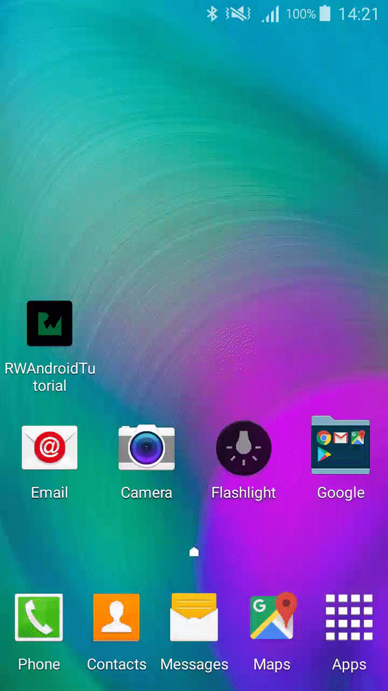

# ANDROID TUTORIAL, TEMPLATE APP PROJECT

[Switch to pre-androidx branch](https://github.com/raywenderlich/RWAndroidTutorial/tree/pre_androidx)

## SUMMARY

This project is a barebones Android Studio project that implements the code style and formatting standards for raywenderlich.com Android Tutorial Sample Projects.

The items implemented are:

- Correct format for the package name
- An RW launcher icon
- A customized RW Splash screen
- A specific RW code style
- A specific RW copyright profile

